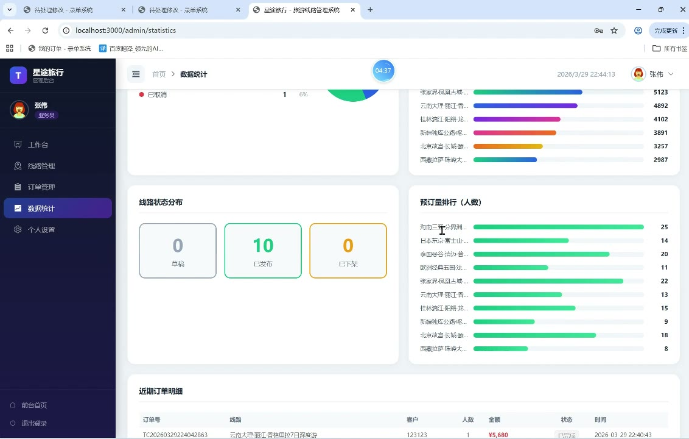
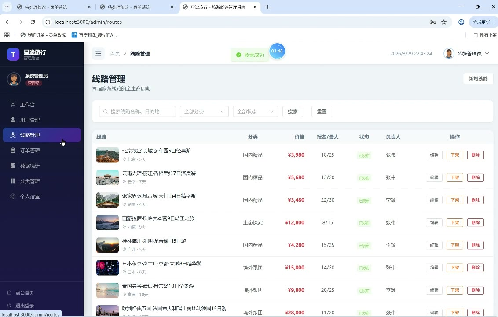
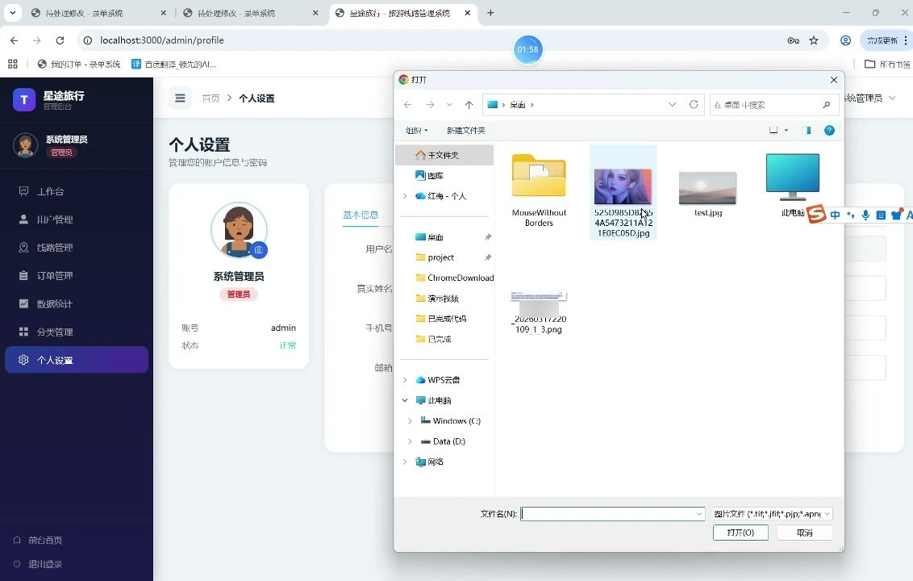

# (附文档)Springboot3+Vue3+MySQL 旅游公司旅游线路管理系统

**技术栈**：Springboot3、Vue3、MySQL

### 系统简介

星途旅行旅游线路管理系统是一套基于 Spring Boot 3 + Vue 3 + MySQL 的 B/S 架构商业软件，采用前后端分离模式。系统内置管理员、业务员、普通客户三类角色，覆盖旅游线路的发布与管理、在线预订下单、订单审核与支付、数据统计看板等完整业务链路，适用于旅游公司日常运营场景。
 
### 核心功能
 
### 普通用户端

 
- 浏览旅游线路列表（支持按关键字搜索、按分类筛选、按业务员筛选） 
- 查看线路详情（展示封面图、多张轮播图、每日行程景点、酒店信息、交通信息） 
- 在线预订线路（选择出行人数，系统自动校验剩余名额并计算总价） 
- 查看我的订单列表（支持按订单状态筛选：待审核/已确认/已支付/已完成/已取消） 
- 查看订单详情（显示订单号、线路名称、人数、金额、客户姓名、业务员姓名） 
- 在线支付订单（点击支付按钮，更新订单状态为已支付并记录支付时间） 
- 个人资料管理（修改真实姓名、手机号、邮箱、头像） 
- 修改登录密码（需验证原密码） 
- 用户注册（填写用户名、真实姓名、手机号、密码） 
- 用户登录（支持用户名+密码登录，返回 JWT Token）
 
### 管理员端

 
- 查看系统概览仪表盘（展示订单总量、在售线路数、待审核订单数、累计收入） 
- 查看热门线路排名（按浏览量排序，展示前 10 条线路的名称、浏览量、预订人数、价格） 
- 查看订单状态分布图（待审核/已确认/已支付/已完成/已取消各状态数量及占比） 
- 查看近期订单列表（最近 7 笔订单的订单号、线路名、客户、人数、金额、状态） 
- 用户管理（分页查询用户列表，支持按关键字/角色筛选，新增、编辑、删除用户） 
- 线路管理（分页查询线路，支持按关键字/分类/状态筛选，新增、编辑、删除线路） 
- 线路上下架管理（一键切换线路状态：草稿/已发布/已下架） 
- 订单管理（查看所有订单列表，修改订单状态，查看订单详情） 
- 分类管理（新增、编辑、删除线路分类，设置分类名称、描述、排序值） 
- 数据统计（查看全局概览数据、线路热度统计、订单状态统计、个人业绩统计） 
- 个人资料与密码管理（修改头像、真实姓名、手机号、邮箱、密码）
 
### 业务员端

 
- 查看个人工作台仪表盘（展示我的订单数、待审核订单数、已完成订单数、负责线路数、累计收入） 
- 查看本人负责的线路列表（分页查询，支持按关键字/分类/状态筛选） 
- 新增线路（填写线路名称、分类、目的地、天数、价格、封面图、描述、亮点、最大人数、出发日期） 
- 编辑线路详情（可修改所有基本字段，并管理行程景点、酒店、交通、轮播图片） 
- 管理行程景点（按天添加景点，设置景点名称、描述、排序） 
- 管理酒店信息（添加酒店名称、星级、位置、描述） 
- 管理交通信息（按天添加交通方式、出发地、目的地、出发/到达时间） 
- 管理线路图片（上传多张轮播图，设置排序） 
- 查看本人负责的订单列表（分页查询，支持按状态筛选） 
- 处理订单审核（确认订单、取消订单操作） 
- 查看个人业绩统计（总订单数、待审核数、已完成数、收入金额、负责线路数） 
- 修改个人资料与密码
 
### 技术栈

 后端框架Spring Boot 3.x ORMMyBatis-Plus 3.x 权限认证JWT（JSON Web Token） 前端框架Vue 3（Composition API + script setup） 状态管理Pinia UI 组件库Element Plus 构建工具Vite 数据库MySQL 8.x 文件上传MultipartFile + 本地存储 前端路由Vue Router 4（history 模式）
 
### 交付内容

 
- 后端完整源码 
- 前端完整源码 
- 数据库初始化脚本 
- 万字文档

## 界面展示

---

## 获取完整源码 + 万字文档

本仓库为项目介绍页。**完整前后端源码、数据库初始化脚本、万字项目文档**，请加微信 `kangkangcode`，或访问 [codekk.top](http://codekk.top) 获取。

可作课程设计 / 毕业设计参考，支持远程部署调试。